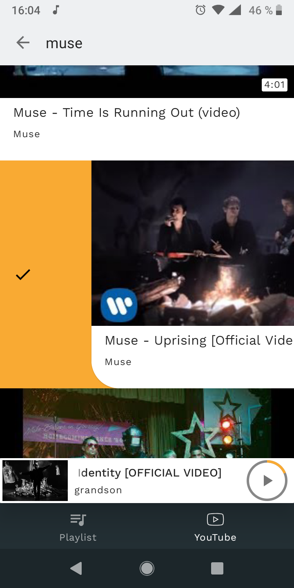
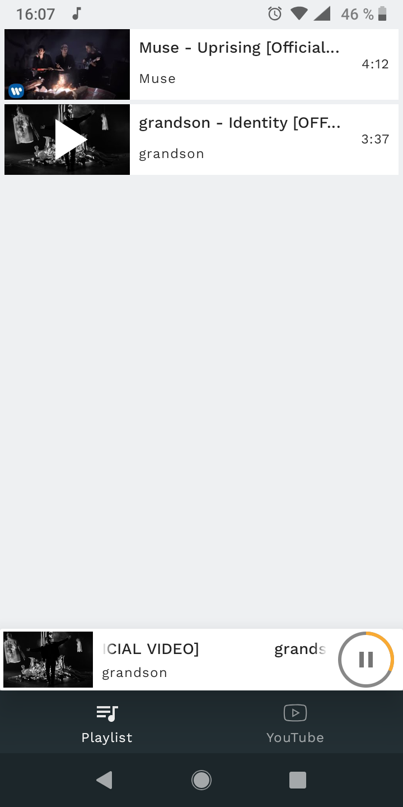
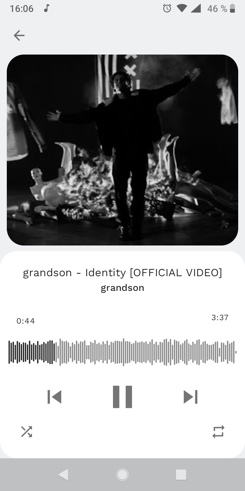

# YTAudio  

Android app that allows you play the audio track of a YouTube video in the background.
## Features
* Background audio playback
* Video search and adding it to a playlist
## Download

## Usage
Swipe right to add video to your playlist

## Screenshots

## Stack
* [Architecture components](https://developer.android.com/topic/libraries/architecture)
* [Kotlin Coroutines](https://github.com/Kotlin/kotlinx.coroutines)
* [Dagger](https://github.com/google/dagger)
* [Retrofit](https://github.com/square/retrofit)
* [Moshi](https://github.com/square/moshi)
* [YTStream](https://github.com/nvvi9/YTStream)
* [ExoPlayer](https://github.com/google/ExoPlayer)
* [CircularProgressBar](https://github.com/lopspower/CircularProgressBar)
* [Audiogram](https://github.com/alxrm/audiowave-progressbar)
